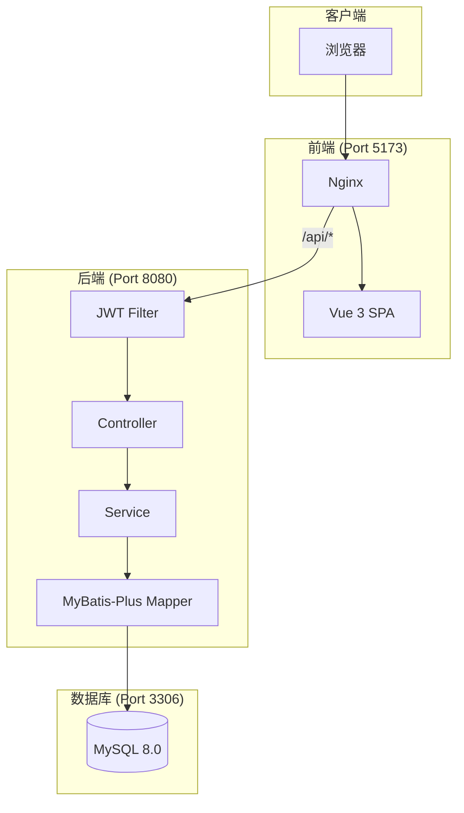

# 🔐 Spring Boot + Vue 全栈登录系统

一个现代化、商业级别的用户认证系统，采用 Spring Boot 3.2 + Vue 3 + MySQL 8.0 技术栈，支持 Docker 一键部署。

---

## 🛠 技术栈

| 层级 | 技术 | 版本 |
|------|------|------|
| **Frontend** | Vue 3 + Vite + Vue Router | 3.4+ / 5.0+ |
| **Backend** | Spring Boot + Spring Security + MyBatis-Plus | 3.2+ / 3.5+ |
| **认证** | JWT (JSON Web Token) | JJWT 0.12+ |
| **Database** | MySQL | 8.0 |
| **Container** | Docker + Docker Compose | Latest |

---

## 🏗️ 系统架构



---

## ✨ 核心特性

### � JWT 会话管理
- 登录/注册返回 `token` 和 `refreshToken`
- 刷新页面后会话保持，无需重新登录
- Token 自动刷新机制
- 无状态认证，支持分布式部署

### 🔒 安全特性
- **BCrypt 密码加密**：Spring Security 默认算法
- **密码迁移**：兼容旧 MD5 密码，首次登录自动升级到 BCrypt
- **JWT 认证过滤器**：保护需要认证的 API 接口

---

## �🚀 快速启动 (Docker)

### 前置条件

- Docker Desktop 已安装并运行
- 确保端口 5173、8080、3306 未被占用

### 启动步骤

```bash
# 1. 进入项目根目录

# 2. 一键启动所有服务
docker compose up --build

# 3. 等待服务启动完成（约2-3分钟）
# 看到 "login-frontend", "login-backend", "login-db" 都显示 healthy 即可
```

### 停止服务

```bash
docker compose down
```

---

## 🔗 服务地址

| 服务 | 地址 | 说明 |
|------|------|------|
| **Frontend** | http://localhost:5173 | 前端页面入口 |
| **Backend API** | http://localhost:8080/api | 后端 API 接口 |
| **Health Check** | http://localhost:8080/api/health | 健康检查接口 |
| **Database** | localhost:3306 | MySQL 数据库 |

---

## 🧪 测试账号

| 用户名 | 密码 | 角色 |
|--------|------|------|
| `admin` | `123456` | 管理员 |
| `testuser` | `123456` | 测试用户 |

> 注：首次使用测试账号登录时，密码将自动从 MD5 迁移到 BCrypt 加密

---

## 📁 项目结构

```
登录/
├── README.md                    # 项目说明文档
├── docker-compose.yml           # Docker 编排配置
│
├── db/                          # 数据库相关
│   └── init.sql                 # 数据库初始化脚本
│
├── backend/                     # 后端 Spring Boot 项目
│   ├── Dockerfile               # 后端 Docker 构建文件
│   ├── pom.xml                  # Maven 依赖配置
│   └── src/main/
│       ├── java/com/login/
│       │   ├── LoginApplication.java      # 启动类
│       │   ├── common/                    # 通用类（Result, ResultCode）
│       │   ├── config/                    # 配置类（Security, JWT, CORS）
│       │   ├── controller/                # 控制器层
│       │   ├── dto/                       # 请求 DTO
│       │   ├── entity/                    # 实体类
│       │   ├── exception/                 # 异常处理
│       │   ├── filter/                    # JWT 认证过滤器
│       │   ├── mapper/                    # 数据访问层
│       │   ├── service/                   # 服务层
│       │   ├── util/                      # 工具类（JwtTokenUtil）
│       │   └── vo/                        # 响应 VO（含 AuthVO）
│       └── resources/
│           └── application.yml            # 应用配置
│
└── frontend/                    # 前端 Vue 3 项目
    ├── Dockerfile               # 前端 Docker 构建文件
    ├── nginx.conf               # Nginx 配置
    ├── package.json             # npm 依赖配置
    ├── vite.config.js           # Vite 配置
    ├── index.html               # HTML 入口
    └── src/
        ├── main.js              # Vue 入口
        ├── App.vue              # 根组件
        ├── router/              # 路由配置（含 Token 验证）
        ├── components/          # 公共组件
        ├── utils/               # 工具类
        │   ├── request.js       # Axios 封装 + Token 管理
        │   └── message.js       # 全局消息服务
        ├── views/               # 页面组件
        └── assets/              # 静态资源
```

---

## 📝 API 接口文档

### 统一响应格式

```json
{
  "code": 200,
  "message": "操作成功",
  "data": { ... },
  "timestamp": 1705891234567
}
```

### 状态码说明

| 状态码 | 说明 |
|--------|------|
| 200 | 操作成功 |
| 400 | 请求参数错误 |
| 401 | 未授权 / Token 无效 |
| 1001 | 用户不存在 |
| 1002 | 密码错误 |
| 1003 | 用户名已存在 |

### 接口列表

#### 1. 用户登录

```http
POST /api/user/login
Content-Type: application/json

{
  "username": "admin",
  "password": "123456"
}
```

**响应示例：**

```json
{
  "code": 200,
  "message": "登录成功",
  "data": {
    "token": "eyJhbGciOiJIUzI1NiJ9...",
    "refreshToken": "eyJhbGciOiJIUzI1NiJ9...",
    "expiresIn": 86400,
    "tokenType": "Bearer",
    "user": {
      "id": 1,
      "username": "admin",
      "nickname": "管理员",
      "email": "admin@example.com"
    }
  },
  "timestamp": 1705891234567
}
```

#### 2. 用户注册

```http
POST /api/user/register
Content-Type: application/json

{
  "username": "newuser",
  "password": "password123",
  "nickname": "新用户",
  "email": "user@example.com"
}
```

#### 3. 获取当前用户信息

```http
GET /api/user/me
Authorization: Bearer <token>
```

#### 4. 刷新 Token

```http
POST /api/user/refresh
Content-Type: application/json

{
  "refreshToken": "eyJhbGciOiJIUzI1NiJ9..."
}
```

#### 5. 用户登出

```http
POST /api/user/logout
Authorization: Bearer <token>
```

#### 6. 健康检查

```http
GET /api/health
```

---

## 🔧 专业工程实践

### 生产级特性清单

| 特性 | 状态 | 说明 |
|------|------|------|
| ✅ JWT 会话管理 | 已实现 | 登录返回 Token，刷新页面保持登录 |
| ✅ BCrypt 密码加密 | 已实现 | Spring Security 标准算法 |
| ✅ Token 自动刷新 | 已实现 | 前端拦截 401 自动刷新 |
| ✅ 密码迁移 | 已实现 | MD5 → BCrypt 自动升级 |
| ✅ 统一响应格式 | 已实现 | Result + ResultCode |
| ✅ 参数校验 | 已实现 | 前后端双重校验 |
| ✅ 跨域配置 | 已实现 | CorsConfig |
| ✅ 全局异常处理 | 已实现 | GlobalExceptionHandler |
| ✅ 日志系统 | 已实现 | SLF4J + Logback |
| ✅ ORM 框架 | 已实现 | MyBatis-Plus |
| ✅ 数据持久化 | 已实现 | Docker Volume |
| ✅ 健康检查 | 已实现 | /api/health |
| ✅ 响应式布局 | 已实现 | 移动端适配 |

---

## 🐳 Docker 配置说明

### 镜像说明

| 服务 | 镜像 | 说明 |
|------|------|------|
| db | mysql:8.0 | MySQL 数据库 |
| backend | maven:3.9-amazoncorretto-17 → amazoncorretto:17-alpine | 多阶段构建 |
| frontend | node:20-alpine → nginx:alpine | 多阶段构建 |

### 环境变量

```yaml
# 数据库
MYSQL_ROOT_PASSWORD: root
MYSQL_DATABASE: login_db

# 后端
DB_HOST: db
DB_USERNAME: root
DB_PASSWORD: root

# JWT 配置
JWT_SECRET: (自动生成的安全密钥)
```

### 数据持久化

数据库数据存储在 Docker Volume `mysql_data` 中，重启容器数据不丢失。

---

## ❓ 常见问题

### Q: Docker 镜像拉取失败？

A: 检查网络连接，或配置 Docker 镜像加速器。

### Q: 后端启动失败？

A: 检查数据库是否启动成功，查看日志：`docker compose logs backend`

### Q: 前端页面无法访问后端 API？

A: 确保前端 Nginx 代理配置正确，检查后端健康状态。

### Q: 刷新页面后显示未登录？

A: 请确保使用最新版本代码，JWT Token 会自动保存在 localStorage 中。

---

## 📄 License

MIT License
